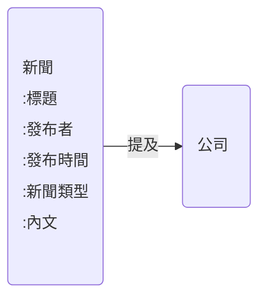
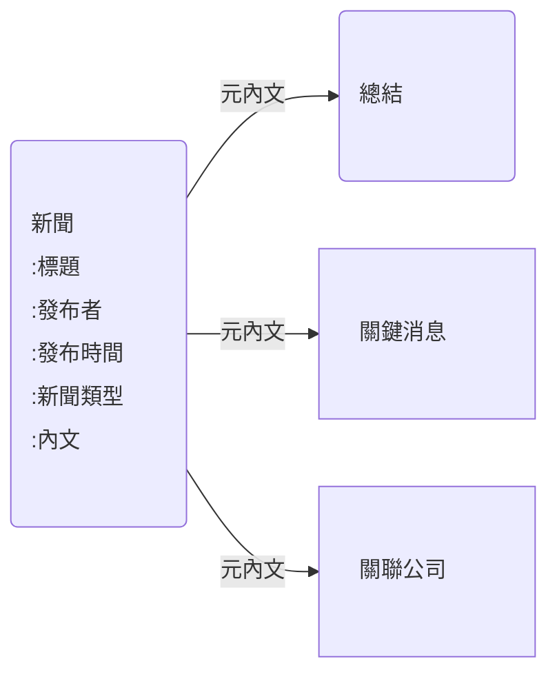

# 公司 關聯 公司
# 新聞 提及 公司



> 如果 cypher 無法即時計算 內文長度，新聞應該要有內文長度的 metadata




```cypher
// 創建新聞內文節點
CREATE (article:`新聞` {
  title: $title,
  content: $content,
  publishDate: datetime($publishDate)
})

// 創建作者節點並與文章建立關係
MERGE (author:`新聞作者` {name: $authorName})
CREATE (author)-[:WROTE]->(article)

// 創建分類節點並與文章建立關係
MERGE (category:`新聞分類` {name: $categoryName})
CREATE (article)-[:BELONGS_TO]->(category)

// 創建標籤節點並與文章建立關係
FOREACH (tagName IN $tagList |
  MERGE (tag:`概念股` {name: tagName})
  CREATE (article)-[:TAGGED]->(tag)
)

// 創建內文總結節點並與文章建立關係
CREATE (summary:`內文總結` {content: $summaryContent})
CREATE (article)-[:HAS_SUMMARY]->(summary)

// 創建關鍵消息節點並與文章建立關係
FOREACH (message IN $keyMessages |
  CREATE (keyMessage:`關鍵消息` {content: message})
  CREATE (article)-[:CONTAINS_KEY_MESSAGE]->(keyMessage)
)

// 添加閱讀次數屬性
SET article.readCount = 0

// 返回創建的文章節點
RETURN article
```

如果新聞沒有

## 格式化新聞

### 公告 

#### 消息源(中央社)

### 盤中速報 

#### 消息源(鉅亨網新聞中心)

### 焦點股

#### 消息源(時報資訊)

### 熱門股

#### 消息源(財訊快報)

### 營收匯報

## 非格式化新聞

### 焦點股

#### 消息源(財訊快報....)

### <<.*>>


