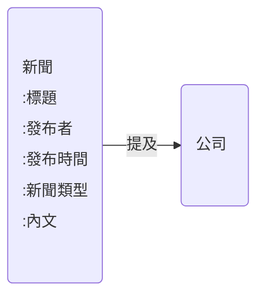
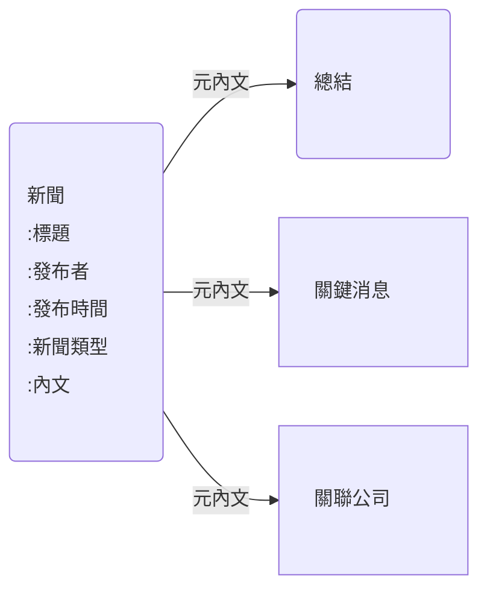

```mermaid
flowchart LR
	公司(公司)
	新聞(    新聞    \n:標題\n:發布者\n:發布時間\n:新聞類型\n:內文)
    新聞:::align --提及-->  公司:::align
    classDef align text-align:left,padding:40px,line-height: 2em;
```

> 如果 cypher 無法即時計算 內文長度，新聞應該要有內文長度的 metadata

```mermaid
flowchart LR
	總結(總結)
	新聞(新聞\n:標題\n:發布者\n:發布時間\n:新聞類型\n:內文)
    新聞:::align --元內文-->  總結:::align
    新聞:::align --元內文-->  關鍵消息:::align
    新聞:::align --元內文-->  關聯公司:::align
    classDef align text-align:left,padding:10px 100px 10px 100px,line-height: 2em;
```

## 格式化新聞

## 非格式化新聞

