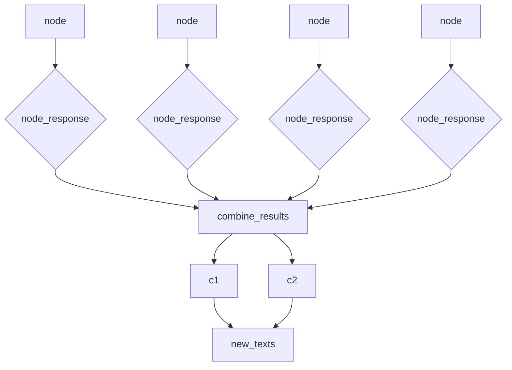

# Building Response Synthesis from Scratch

接續上期資料從 retriever 順利取得對應 Query 的 Nodes Set，但是 retrieved context 可能會overflows the context window.

這時候就需要使用一些RAG策略:
    1. Create and Refine
    2. Tree Summarization

## 最簡單的 prompt 策略

```py
from llama_index.llms.openai import OpenAI
from llama_index.core import PromptTemplate

llm = OpenAI(model="text-davinci-003")

qa_prompt = PromptTemplate(
    """\
Context information is below.
---------------------
{context_str}
---------------------
...
Query: {query_str}
Answer: \
"""
)

query_str = ("...")

retrieved_nodes = retriever.retrieve(query_str)

def generate_response(retrieved_nodes, query_str, qa_prompt, llm):
    context_str = "\n\n".join([r.get_content() for r in retrieved_nodes])
    fmt_qa_prompt = qa_prompt.format(
        context_str=context_str, query_str=query_str
    )
    response = llm.complete(fmt_qa_prompt)
    return str(response), fmt_qa_prompt

response, fmt_qa_prompt = generate_response(
    retrieved_nodes, query_str, qa_prompt, llm
)

print(f"*****Response******:\n{response}\n\n")

print(f"*****Formatted Prompt*****:\n{fmt_qa_prompt}\n\n")


```

以上策略即是將，所有 retrieved_nodes 串接成 context strings 連帶 query_str 送給 llm
但以下條件出現就會出現問題:
1. retriever 的 top-k 提升
2. 建立index的階段，Transformations 策略沒有做好，單位 context 分塊過大

## Refine
```py
refine_prompt = PromptTemplate(
    """\
The original query is as follows: {query_str}
We have provided an existing answer: {existing_answer}
We have the opportunity to refine the existing answer \
(only if needed) with some more context below.
------------
{context_str}
------------
Given the new context, refine the original answer to better answer the query. \
If the context isn't useful, return the original answer.
Refined Answer: \
"""
)

from llama_index.core.response.notebook_utils import display_source_node


def generate_response_cr(
    retrieved_nodes, query_str, qa_prompt, refine_prompt, llm
):
    """Generate a response using create and refine strategy.

    The first node uses the 'QA' prompt.
    All subsequent nodes use the 'refine' prompt.

    """
    cur_response = None
    fmt_prompts = []
    for idx, node in enumerate(retrieved_nodes):
        print(f"[Node {idx}]")
        display_source_node(node, source_length=2000)
        context_str = node.get_content()
        if idx == 0:
            fmt_prompt = qa_prompt.format(
                context_str=context_str, query_str=query_str
            )
        else:
            fmt_prompt = refine_prompt.format(
                context_str=context_str,
                query_str=query_str,
                existing_answer=str(cur_response),
            )

        cur_response = llm.complete(fmt_prompt)
        fmt_prompts.append(fmt_prompt)

    return str(cur_response), fmt_prompts

response, fmt_prompts = generate_response_cr(
    retrieved_nodes, query_str, qa_prompt, refine_prompt, llm
)

print(str(response))
# view a sample qa prompt
print(fmt_prompts[0])
# view a sample refine prompt
print(fmt_prompts[1])
```

Refine 策略確實可以將單次輸入的 prompt 限制在一定的範圍內確保不會超過context的最大限制，但隨之而來的問題也十分明顯，只要 retriever 回傳多少 retrieved_nodes 就會反覆調用多少LLM API無論是

1. 回應時間
2. 成本開銷

都過於巨大。

## Hierarchical Summarization Strategy




```python
async def acombine_results(
    texts,
    query_str,
    qa_prompt,
    llm,
    cur_prompt_list,
    num_children=10,
):
    fmt_prompts = []
    for idx in range(0, len(texts), num_children):
        text_batch = texts[idx : idx + num_children]
        context_str = "\n\n".join([t for t in text_batch])
        fmt_qa_prompt = qa_prompt.format(
            context_str=context_str, query_str=query_str
        )
        fmt_prompts.append(fmt_qa_prompt)
        cur_prompt_list.append(fmt_qa_prompt)

    tasks = [llm.acomplete(p) for p in fmt_prompts]
    combined_responses = await asyncio.gather(*tasks)
    new_texts = [str(r) for r in combined_responses]

    if len(new_texts) == 1:
        return new_texts[0]
    else:
        return await acombine_results(
            new_texts, query_str, qa_prompt, llm, num_children=num_children
        )


async def agenerate_response_hs(
    retrieved_nodes, query_str, qa_prompt, llm, num_children=10
):
    """Generate a response using hierarchical summarization strategy.

    Combine num_children nodes hierarchically until we get one root node.

    """
    fmt_prompts = []
    node_responses = []
    for node in retrieved_nodes:
        context_str = node.get_content()
        fmt_qa_prompt = qa_prompt.format(
            context_str=context_str, query_str=query_str
        )
        fmt_prompts.append(fmt_qa_prompt)

    tasks = [llm.acomplete(p) for p in fmt_prompts]
    node_responses = await asyncio.gather(*tasks)

    response_txt = combine_results(
        [str(r) for r in node_responses],
        query_str,
        qa_prompt,
        llm,
        fmt_prompts,
        num_children=num_children,
    )

    return response_txt, fmt_prompts

response, fmt_prompts = await agenerate_response_hs(
    retrieved_nodes, query_str, qa_prompt, llm
)
```

llm API 的開銷比refine策略更大，但相對於refine 需要等待 existing_answer，generate_response_hs 可以使用非同步呼叫llm api，最後由 combine_results 遞歸完成最後總結。
如果運算資源足夠，回應的速度可以有機會超越refine策略。但llm api的調用次數肯定比 refine策略 頻繁。
