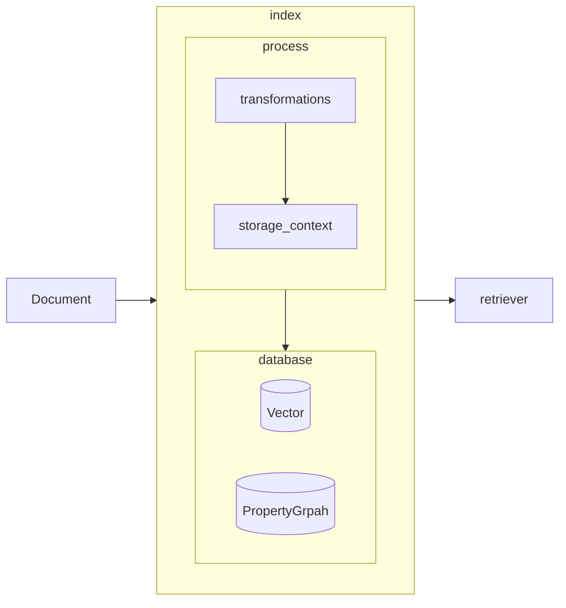

high-level LlamaIndex abstractions to 
1) ingest data into Pinecone, and then 
2) get a vector retriever.


```py
vector_store = PineconeVectorStore(pinecone_index=pinecone_index)
# NOTE: set chunk size of 1024
splitter = SentenceSplitter(chunk_size=1024)
storage_context = StorageContext.from_defaults(vector_store=vector_store)
index = VectorStoreIndex.from_documents(
    documents, transformations=[splitter], storage_context=storage_context
)
```